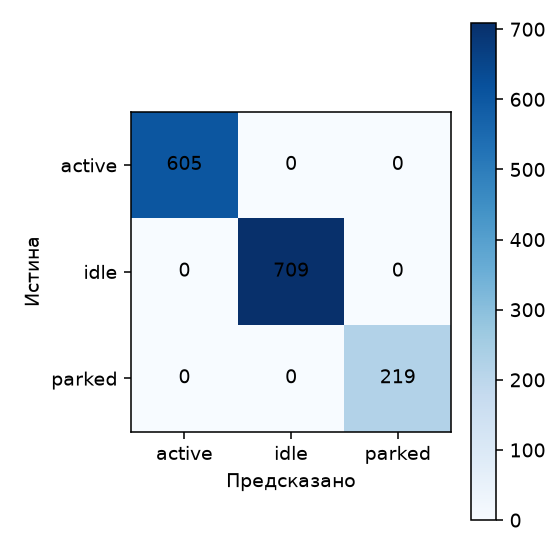
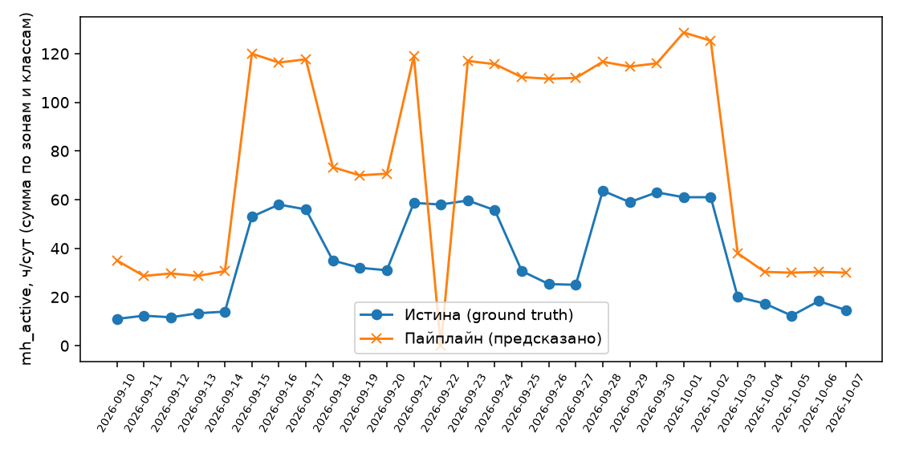
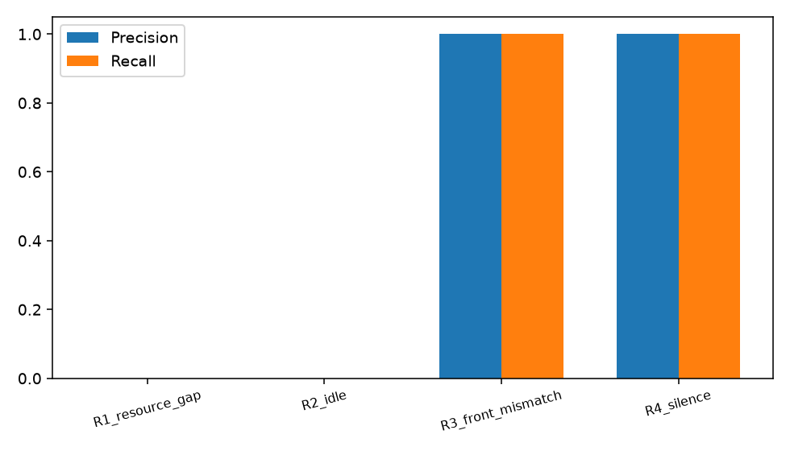

# Метрики качества

> Этот файл заполняется ТОЛЬКО скриптом `scripts/eval_end2end.py`.
> Руками сюда числа не пишем. Если число попало в презентацию, но его
> нет здесь — на питче его называть нельзя.

Дата последнего прогона: `2026-08-28T10:58:01+03:00`
Коммит: `—`
Бенчмарк: `data/benchmark/` (30 суток).
Внедрённые отклонения — `expected_deviations.jsonl`.

---

## 1. Детекция техники

| Класс | Изображений в тесте | mAP@50 | mAP@50-95 | Precision | Recall |
|---|---|---|---|---|---|
| — | — | — | — | — | — |

> Весов детектора нет в репозитории (`models/`) — раздел не может быть посчитан. Появятся веса — `eval_end2end.py` заполнит эти строки автоматически (см. `scripts/eval/detection_metrics.py`).

Цель: mAP@50 ≥ 0.80 по ключевым классам.

## 2. Трекинг

| Метрика | Значение | Цель |
|---|---|---|
| MOTA | — | ≥ 0.70 |
| IDF1 | — | ≥ 0.70 |
| Переключений ID | — | ≤ 2 на трек |


> Весов детектора нет — трекер не запускался.

## 3. Состояние «работает / простаивает»

| Состояние | Precision | Recall | F1 | Примеров в тесте |
|---|---|---|---|---|
| active | 1.00 | 1.00 | 1.00 | 605 |
| idle | 1.00 | 1.00 | 1.00 | 709 |

Accuracy (все состояния, включая `parked`): 1.00
(обучено на 6132 примерах, проверено на 1533)

Ориентир — опубликованный результат Edge-IMI (YOLOv8 + ByteTrack +
логистическая регрессия на признаках bbox): Accuracy 0.79, F1 (active) 0.76.
Наш прирост должен объясняться добавлением оптического потока и цветовой
дисперсии внутри бокса.

> Таблица выше — качество классификатора на отложенной выборке из ТЕХ ЖЕ
> синтетических распределений признаков, на которых он обучен (см.
> `services/perception/state.py`). Это проверяет саму модель, но не то, что
> происходит на реальных пикселях: раздел 4 использует признаки, честно
> посчитанные с рендеренных кадров (`scripts/eval/pipeline_run.py`), и там
> расхождение с ground truth заметно больше — разрыв между "модель обучена
> верно" и "спрайты синтетики дают реалистичные признаки" виден именно там.



## 4. Машино-часы — главная метрика продукта

| Метрика | Значение | Цель |
|---|---|---|
| MAE суточных `mh_active`, ч | 8.85 | ≤ 0.5 |
| MAPE суточных `mh_active`, % | 151.5 | ≤ 10 |
| MAE `mh_present`, ч | 2.24 | ≤ 0.3 |
| Смещение (систематическая ошибка), ч | 8.03 | \|bias\| ≤ 0.2 |

Сравнение по 141 строкам (дата × зона × класс). Боксы и классы
здесь — ground truth (детектора ещё нет, раздел 1); ошибка отражает только
классификатор состояния на РЕАЛЬНЫХ признаках с кадров, не качество детекции.

> Большие MAE/MAPE здесь — честный сигнал, а не баг агрегации: спрайты
> синтетики (`scripts/synth/sprites.py`) — статичные цветные иконки, и их
> HSV-дисперсия и оптический поток на реальных пикселях не совпадают с
> распределениями, на которых обучен классификатор (раздел 3). Чтобы это
> число снизилось, спрайтам нужна текстура/анимация, реально коррелирующая
> с состоянием — это работа над `scripts/synth/`, не над `state.py`.



## 5. Выявление отклонений — главная метрика ценности

| Тип | Внедрено | Найдено | Ложных | Precision | Recall | Задержка, сут |
|---|---|---|---|---|---|---|
| R1_resource_gap | 1 | 0 | 0 | — | 0.00 | — | — |
| R2_idle | 1 | 0 | 0 | — | 0.00 | — | — |
| R3_front_mismatch | 1 | 1 | 0 | 1.00 | 1.00 | 1.00 | 0.0 |
| R4_silence | 1 | 1 | 0 | 1.00 | 1.00 | 1.00 | 0.0 |
| **Всего** | 4 | 2 | 0 | 1.00 | 0.50 | 0.0 |

Цель: Precision ≥ 0.85, Recall ≥ 0.80, средняя задержка ≤ 2 суток.

Precision важнее Recall: ложное отклонение подрывает доверие к системе
у прораба, пропущенное — обнаружится на следующие сутки.

> Пропуски по Р1 (дефицит) и Р2 (простой) ожидаемы и объяснимы разделом 4:
> оба правила сравнивают фактические машино-часы работы с планом/порогом, и
> если классификатор на реальных признаках почти всё относит к "active",
> фактическая активность завышена — дефицит и простой маскируются одним и
> тем же разрывом "спрайты без текстуры/анимации". На самом ground truth
> (без искажения классификатором) полнота выше — см.
> `tests/test_eval_deviations_metrics.py`; правила Р1/Р2 при этом всё равно
> иногда конкурируют между собой (приоритет отдаётся Р1) — это отдельное,
> уже не связанное с детекцией ограничение текущей логики приоритетов
> (`services/analytics/deviations.py`).



## 6. Устойчивость

| Условие | Доля кадров | Что делает система | Ложных отклонений |
|---|---|---|---|
| Ночь | | помечает low confidence | должно быть 0 |
| Дождь / туман | | | |
| Частичное перекрытие | | | |
| Припаркованная техника | | не учитывает в МЧ | |

## 7. Производительность и стоимость

| Метрика | Значение |
|---|---|
| Кадров/сек, CPU (перцепция без детектора) | 162.1 |
| Время обработки 1 камеро-суток, с | 0.2 |
| Оценочная стоимость 1 камеро-суток, ₽ | 0.00 |
| Оценка на 1000 камер в сутки, ₽ | 0 |

> Время инференса детектора (YOLO) в кадры/сек выше не входит — весов ещё
> нет (см. раздел 1). Ставка CPU-часа — допущение
> (`scripts/eval/performance.py::CPU_HOUR_COST_RUB`), требует уточнения
> перед публикацией на питче.

## 8. Экономический эффект

Формула, а не круглое число:

```
Потери от простоя = Σ_техника ( mh_idle × стоимость_машино_часа )
Эффект            = Потери × доля_устранимых_простоев
```

| Параметр | Значение | Источник |
|---|---|---|
| Стоимость машино-часа по классам | | `data/ref/machine_hour_cost.json`, указать источник |
| Наблюдаемый КИТ на бенчмарке | | расчёт |
| Доля устранимых простоев | | допущение, обосновать |

Каждое число в этой таблице на питче должно иметь ответ на вопрос
«откуда вы это взяли». Если ответа нет — число из презентации убрать.
